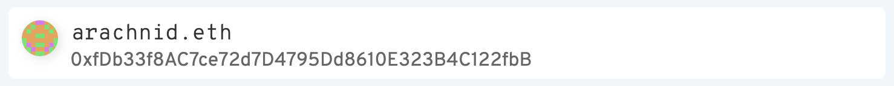
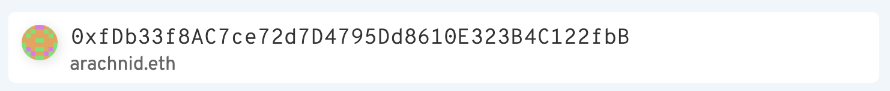

# React ENS Address Component

The Address component is a drop-in React component for your dapps. Anytime you need to take an address as an input, you can use the React ENS Address Component instead to resolve ENS names or provide feedback with reverse records.





### Installation

React ENS Address Component can be installed via npm:

```bash
$ yarn add @ensdomains/react-ens-address
```

```bash
$ npm install --save @ensdomains/react-ens-address
```

#### Parameters:

- presetValue - sets a default value for the input
- provider - Web3 provider **(required)**
- placeholder - set custom placeholder. Default: 'Enter Ethereum name or address'
- showBlockies - show digital image based on address (similar to github). Default: true
- DefaultIcon: Component - Icon to show on the left when nothing has been typed. Default: null
- onResolve - callback. Invokes when address or name resolved and also when there is an error. The callback is called with a `resolutionObject`. This has 4 properties:

```
{
  name: 'vitalik.eth',
  address: '0x123...',
  type: "address" // "address" or "name" is the inputValue type
  input: "0x123..." // if the resolve is called and returns an error, it will return with the other properties as null and only input will be defined
}
```

- onError - callback. Invokes every time error is occurs or invalid name is typed. When typed name is corrected, invokes with null after error.
- className - any custom class for styling. Already implemented `small` class renders component in small size


#### Styling

All styling made in `style.css`. It can be take as a start point.
`.cmp-address` - reserved class for that component.
`.cmp-address.small` - for small type of component. Overriding other classes under that parent you can safety style a component.

### Basic Example 1

```jsx
import ENSAddress from '@ensdomains/react-ens-address'

function Component() {
  return <ENSAddress provider={window.web3 || window.ethereum} />
}
```

#### Basic Example 2

```jsx
import React, { useState } from 'react'
import ENSAddress from '@ensdomains/react-ens-address'

function AddressInput() {
  const [resolved, setResolved] = useState({})
  const [type, setType] = useState(undefined)
  return (
    <>
      <ENSAddress
        provider={window.web3 || window.ethereum}
        onResolve={({ name, address, type }) => {
          if (type) {
            setResolved({
              value: address,
              type
            })
          }
        }}
      />
      {resolvedInput.type === 'address' &&
        `We found your reverse record ${resolved.value}`}
      {resolvedInput.type === 'name' &&
        `We found your address record ${resolved.value}`}
    </>
  )
}
```

#### Credit

Original version was built by [@industral](https://github.com/industral), which was then edited and published by [@jefflau](https://github.com/jefflau)
